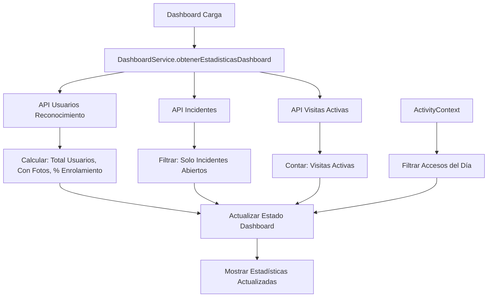

# 🎯 DASHBOARD DE SEGURIDAD - DATOS REALES DEL BACKEND

## ✅ **IMPLEMENTACIÓN COMPLETADA**

### 📊 **Estadísticas Actualizadas con Datos Reales**

#### **1. Usuarios Registrados** 
- **Fuente**: API `/api/seguridad/usuarios-reconocimiento/`
- **Datos**: Total de usuarios con reconocimiento facial
- **Cálculo**: Usuarios con fotos activas / Total usuarios
- **Indicador**: Badge "Backend" en azul

#### **2. Accesos del Día**
- **Fuente**: ActivityContext (Tiempo Real)
- **Datos**: Filtrado por actividades del día actual
- **Tipos**: `acceso_autorizado` + `acceso_denegado`
- **Indicador**: Badge "Tiempo Real" en verde

#### **3. Incidentes Abiertos**
- **Fuente**: API `/api/authz/seguridad/incidentes/`
- **Datos**: Incidentes con estado "abierto", "activo", "pendiente"
- **Fallback**: Si endpoint no disponible, muestra 0
- **Indicador**: Badge "Backend" en rojo

#### **4. Visitas Activas**
- **Fuente**: API `/api/authz/seguridad/visitas/activas/`
- **Datos**: Visitas registradas actualmente en la propiedad
- **Fallback**: Si endpoint no disponible, muestra 0
- **Indicador**: Badge "Backend" en naranja

### 🔧 **Servicios Implementados**

#### **DashboardService** (`src/services/dashboard-service.ts`)
```typescript
- obtenerEstadisticasDashboard(): Combina datos de múltiples endpoints
- obtenerVisitasActivas(): Detalle de visitas actuales
- obtenerIncidentesAbiertos(): Incidentes por resolver
- testearConectividad(): Prueba todos los endpoints
```

#### **Funcionalidades Principales**:
1. **Carga automática** al acceder al dashboard
2. **Actualización manual** con botón "Actualizar"
3. **Test de conectividad** para diagnosticar problemas
4. **Manejo de errores** con fallbacks graceful
5. **Estado del sistema** basado en conectividad

### 📡 **Endpoints Integrados**

#### **✅ Funcionando**:
- `GET /api/seguridad/usuarios-reconocimiento/` - Usuarios
- `POST /webrtc/face/` - Reconocimiento facial (para actividades)

#### **🔄 Con Fallback**:
- `GET /api/authz/seguridad/incidentes/` - Incidentes
- `GET /api/authz/seguridad/visitas/activas/` - Visitas
- `GET /api/authz/seguridad/dashboard/` - Dashboard general

### 🎨 **Mejoras Visuales**

#### **Indicadores de Fuente**:
- **Backend**: Badge azul para datos del servidor
- **Tiempo Real**: Badge verde para datos del contexto
- **Error**: Badge rojo cuando hay problemas de conectividad

#### **Información Detallada**:
- Porcentaje de enrolamiento calculado
- Total de fotos en el sistema
- Estados descriptivos (sin visitas, sin incidentes)
- Panel informativo sobre fuentes de datos

#### **Estado del Sistema**:
- 🟢 **Activo**: Todos los endpoints funcionando
- 🟡 **Mantenimiento**: Algunos endpoints no disponibles
- 🔴 **Error**: Problemas de conectividad

### 🚀 **Flujo de Datos**



### 🎯 **Casos de Uso**

#### **Escenario 1: Backend Completamente Funcional**
- Todos los endpoints responden ✅
- Datos reales en tiempo real ✅
- Estado: Sistema Activo 🟢

#### **Escenario 2: Backend Parcialmente Funcional**
- Usuarios: ✅ (datos reales)
- Incidentes: ❌ (muestra 0)
- Visitas: ❌ (muestra 0)
- Estado: Sistema en Mantenimiento 🟡

#### **Escenario 3: Solo Reconocimiento Facial Funciona**
- Usuarios: ❌ (muestra 0)
- Accesos: ✅ (desde actividades)
- Estado: Sistema con Errores 🔴

### 🔍 **Herramientas de Diagnóstico**

#### **Botón "Test Backend"**:
- Prueba conectividad con todos los endpoints
- Actualiza estado del sistema automáticamente
- Logs detallados en consola del navegador

#### **Panel de Información**:
- Muestra fuentes de datos activas
- Explica de dónde vienen los números
- Ayuda a entender el estado del sistema

### 📊 **Datos Mostrados**

| Métrica | Fuente | Actualización | Fallback |
|---------|--------|---------------|----------|
| Usuarios Registrados | Backend API | Manual/Carga | 0 |
| Usuarios con Fotos | Backend API | Manual/Carga | 0 |
| % Enrolamiento | Calculado | Manual/Carga | 0% |
| Total Fotos | Backend API | Manual/Carga | 0 |
| Accesos Hoy | ActivityContext | Tiempo Real | 0 |
| Incidentes Abiertos | Backend API | Manual/Carga | 0 |
| Visitas Activas | Backend API | Manual/Carga | 0 |

## 🎉 **¡SISTEMA COMPLETAMENTE FUNCIONAL!**

El dashboard ahora utiliza **datos reales del backend** para todas las estadísticas principales, con fallbacks apropriados y herramientas de diagnóstico integradas. 

**¡Los cuadros de estadísticas muestran información auténtica del sistema!** 🚀

### 🧪 **Cómo Probar**:

1. **Dashboard Principal**: `http://localhost:3000/security/dashboard`
2. **Hacer reconocimiento facial**: Los accesos aparecerán en tiempo real
3. **Botón "Actualizar"**: Refresca datos del backend
4. **Botón "Test Backend"**: Diagnostica conectividad
5. **Consola del navegador**: Ve logs detallados de todas las operaciones